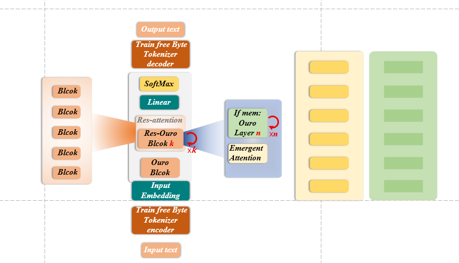

<div align="center">

<picture>
  <source
    media="(prefers-color-scheme: dark)"
    srcset="./website/assets/ouro/ouro-lockup-tagline-light.svg">
  
</picture>

</div>

<div align="center">


[](https://github.com/zhihumomo/ouro/stargazers)
[](LICENSE)
[](https://github.com/zhihumomo/ouro/commits)
[](https://github.com/zhihumomo/ouro/pulls)

</div>

<div align="center">
  <h3>"我来从无聊的世界中拯救你了"</h3>
</div>

<div align="center">

中文 | [English](./README_en.md)

</div>

* 此开源项目从 0 实现广义递归架构 `Ouro`，并以字节级语言模型 `Gridman` 作为实验载体。
* Ouro 不是传统逐 token RNN：它在固定小片段内保留局部因果注意力，并维护向量、时间队列和矩阵状态。
* 在模型配置固定时，持久状态结构不随累计历史长度继续增长；这一性质也存在于 stateful RNN，Ouro 的研究差异在于状态组织、局部注意力和宽度—状态扩展方式。
* 仓库提供 Pretrain / SFT 训练代码路径；端到端阶段继承、恢复等价性、跨 rank 一致性和扩展效率按各自证据等级验证，不笼统称为已验证的“完整训练链路”。
* 项目所有核心算法代码均从 0 使用 PyTorch 原生实现, 不依赖第三方库提供的高层抽象接口.
* 这是一套面向 `Ouro` 架构研究、代码阅读和实验复现的开放起点。
* 希望此项目能为更多人提供一个可复现, 可理解, 可扩展 `Ouro` 的起点, 一起感受状态 AI 模型的魅力, 并推动更广泛 AI 社区的进步, 为未来世界的变革做好准备.
* 项目交流 QQ 群: 198302483. 答案: State.

> 注：本项目基于 Apache 2.0 协议开源; 训练时长和成本在不同硬件上可能存在较大差异.

## 先读：当前事实与证据边界

Ouro 在广义上属于递归架构。它与 RNN/LSTM/GRU 都会把先前状态带入下一步；差异不在于“有没有状态”，而在于 Ouro 采用 **64 字节级小片段内的局部因果注意力**，并同时维护 `c_state`、`c_state_queue` 和矩阵 `mem`。固定配置下的状态结构与历史长度解耦是一类递归系统的共享属性，不等于无限上下文、无损记忆、恒定总显存或绝对恒定推理速度。

训练采用“**状态连续、梯度截断**”：在同一兼容模型谱系内，正常 Pretrain、SFT、兼容后训练和运行路径默认保留状态；BPTT 边界上的 `mem_detach()` 只截断更早的计算图，不清空状态值。状态 reset 只允许由显式诊断、消融或恢复操作触发。不同宽度属于不同模型谱系，当前不实现 1280→2624 的隐式状态迁移。

当前真实 artifact 是一个 **Pretrain checkpoint**，证据标签为 `PRELIMINARY`。Factory state、实例 snapshot / restore / fork / lineage 和生产隔离属于规划中的 MaPhY Runtime，当前仓库只证明架构和模型对象可以保存已注册状态，不能据此声称 Runtime 已实现。

---

# 📌 架构优势

<table style="width: 100%; border-collapse: separate; border-spacing: 12px; background: transparent; border: none; table-layout: fixed;">
  <tr>
    <td style="background: linear-gradient(145deg,#1a1a1a,#111); border-radius: 16px; padding: 22px; border: 1px solid rgba(255,255,255,0.1); vertical-align: top;">
      <div style="color:rgba(255,255,255,0.7); font-size:13px; margin-bottom:10px;">⚙️ Theory</div>
      <div style="color:#fff; font-size:19px; font-weight:600; margin-bottom:6px;">状态架构原型</div>
      <div style="color:rgba(255,255,255,0.5); font-size:12px;">Persistent-state prototype</div>
    </td>
    <td style="background: linear-gradient(145deg,#1a1a1a,#111); border-radius: 16px; padding: 22px; border: 1px solid rgba(255,255,255,0.1); vertical-align: top;">
      <div style="color:rgba(255,255,255,0.7); font-size:13px; margin-bottom:10px;">⚡ Speed</div>
      <div style="color:#fff; font-size:19px; font-weight:600; margin-bottom:6px;">小片段持续处理</div>
      <div style="color:rgba(255,255,255,0.5); font-size:12px;">Chunkwise processing</div>
    </td>
    <td style="background: linear-gradient(145deg,#1a1a1a,#111); border-radius: 16px; padding: 22px; border: 1px solid rgba(255,255,255,0.1); vertical-align: top;">
      <div style="color:rgba(255,255,255,0.7); font-size:13px; margin-bottom:10px;">💾 VRAM</div>
      <div style="color:#fff; font-size:19px; font-weight:600; margin-bottom:6px;">固定状态结构</div>
      <div style="color:rgba(255,255,255,0.5); font-size:12px;">Fixed state under a fixed configuration</div>
    </td>
  </tr>
  <tr>
    <td style="background: linear-gradient(145deg,#1a1a1a,#111); border-radius: 16px; padding: 22px; border: 1px solid rgba(255,255,255,0.1); vertical-align: top;">
      <div style="color:rgba(255,255,255,0.7); font-size:13px; margin-bottom:10px;">📦 No Cache</div>
      <div style="color:#fff; font-size:19px; font-weight:600; margin-bottom:6px;">非增长式历史路径</div>
      <div style="color:rgba(255,255,255,0.5); font-size:12px;">No growing token-history KV path</div>
    </td>
    <td style="background: linear-gradient(145deg,#1a1a1a,#111); border-radius: 16px; padding: 22px; border: 1px solid rgba(255,255,255,0.1); vertical-align: top;">
      <div style="color:rgba(255,255,255,0.7); font-size:13px; margin-bottom:10px;">✨ Learning</div>
      <div style="color:#fff; font-size:19px; font-weight:600; margin-bottom:6px;">前向状态更新</div>
      <div style="color:rgba(255,255,255,0.5); font-size:12px;">Forward state updates implemented</div>
    </td>
    <td style="background: linear-gradient(145deg,#1a1a1a,#111); border-radius: 16px; padding: 22px; border: 1px solid rgba(255,255,255,0.1); vertical-align: top;">
      <div style="color:rgba(255,255,255,0.7); font-size:13px; margin-bottom:10px;">∞ Context</div>
      <div style="color:#fff; font-size:19px; font-weight:600; margin-bottom:6px;">长流行为待验证</div>
      <div style="color:rgba(255,255,255,0.5); font-size:12px;">Long-stream behavior under evaluation</div>
    </td>
  </tr>
</table>

---

# 📌 项目介绍

注意力机制以及 `Transformer` 架构的出现, 拉开了了大语言模型和全民 AI 时代的序幕. 从 2022 年 GPT-3.5 第一次震惊世界开始, 时间连带着模型尺寸飞速增长, 整个 AI 世界在朝前狂奔. 但站在真正起作用的底层架构的视角上回顾, 我们似乎一直在原地踏步. 

那么问题是什么？本项目关注的不是把现有架构简单描述为“无状态”，而是连续性通常由哪一层承担：模型内部递归状态、token/KV 上下文、检索系统和 Agent memory 都可以承载不同形式的连续性。Ouro 探索的是让显式状态直接参与下一片段计算，并为状态保留建立清晰的生命周期契约。

该项目尝试对这一默认前提进行一次彻底的反转. 不再将 AI 视为一个输入驱动的函数近似器, 而是将其构建为一个围绕内部 State 持续运行的系统. 在这一视角下: 

- State 不是可随请求任意丢弃的性能缓存
- State 与 prompt、KV/context、检索和外部 Agent memory 是不同但可互补的机制
- Self 是产品层对持续保留并更新的内部状态整体的称呼，不表示意识、人格或心理身份

相反, State 是模型的核心主体. 

这正是 `Ouro` 构建的核心哲学: **State is all you need**.

😊 一起感受状态模型的乐趣吧！

---

#### 🎉 本项目包含以下内容

- 提供 `Ouro-Naxi` 持续状态架构及当前实现对应的研究资料；理论推导不等同于已完成实验验证.
- 提供完整的 `Ouro` 结构代码，作为持续状态架构的开放研究起点.
- 提供 `Gridman` 的 Pretrain / SFT 训练代码路径；跨阶段状态继承已进入代码契约和自动测试，真实连续训练验证仍待完成.
- 提供 `ByteTokenizer` 无需任何先验分词器, 支持自定义模板标记扩展.
- 覆盖 Pretrain 与 SFT 入口，并明确区分“从 Pretrain 开始 SFT”和“恢复 SFT”两种 checkpoint 来源.
- 记录训练数据来源与处理方式；本仓库当前未提供可审计的全阶段数据下载包.
- 提供原生 `StreamLoader` 数据加载器, 保证数据流贴合架构特性. 
- 提供基于 DDP / NCCL 的多卡训练代码路径；跨 rank 一致性与扩展效率仍待系统验证.
- 关键训练算法与核心模块均从 0 实现, 不依赖第三方框架封装.

#### 🎉 已 (预) 发布架构/模型列表

<details> 
<summary> <b>🔥 Ouro-Naxi</b> </summary>

`Ouro` 架构 `v1` 版本命名为 `Naxi`, 源自中国地名纳溪, 取纳溪成川之意. 后统一用 `-Naxi` 指代 `v1` 架构版本及对应的 `Gridman` 模型版本.

使用 `Ouro-Naxi` 架构训练的原生字节级语言模型 `Gridman` 模型列表:

<details> 
<summary> <b>v0d1</b> </summary>

| 模型 | 参数量 | 嵌入维度 | Blocks | Layers | Release |
|------|--------|--------|------|------|---------|
| Gridman-Naxi-v0d1 Experimental Reference Model | 355.49 M trainable | 1280 | 2 | 4 | Pretrain checkpoint · Preliminary · external |

</details>


<details> 
<summary> <b>v0d2 (即将发布)</b> </summary>

</details>

</details>

> **2026-07 审计口径：** 当前源码配置为 `embed_dim=1280`、`blocks=2`、`block_layers=4`、`patch_size=64`、`chunk_size=64`、`bptt_size=7`。行业通用模型规模口径为 **355,491,887 可训练参数**；**365.32M repository tracked scale** 仅作为技术口径，等于可训练参数加 **9,830,400 个矩阵状态元素**。一个配置为 64 个 state slots 的模型对象共有 **15,400,960 个注册持久状态元素**；它是结构 footprint，不是已验证的记忆质量分数。Checkpoint 当前位于仓库外部，其 SHA-256、数据 manifest 与公开发布状态仍待补齐。

### 受控宽度—状态容量扩展研究

以下五档配置只改变 `embed_dim`，共同固定 `blocks=2`、`block_layers=4`、`patch_size=64`、`chunk_size=64` 和 `bptt_size=7`。除 1280 档外均没有训练结果。

| Width | 可训练参数 | 矩阵状态 | 全部注册持久状态 @64 | 证据标签 |
|---:|---:|---:|---:|---|
| 512 | 58.05M | 1.57M | 3.80M | `STATIC CONFIGURATION · NOT TRAINED` |
| 768 | 126.79M | 3.54M | 6.88M | `STATIC CONFIGURATION · NOT TRAINED` |
| 1280 | 355.49M | 9.83M | 15.40M | `WORKING CHECKPOINT · PRELIMINARY` |
| 1856 | 744.24M | 20.67M | 28.75M | `STATIC CONFIGURATION · NOT TRAINED` |
| 2624 | 1.483B | 41.31M | 52.73M | `PLANNED MODEL LINEAGE` |

研究目标是 **characterize width–state scaling behavior**，不是在结果产生前宣称已经证明 scaling law。状态元素数量只描述结构规模，不可直接等同于功能性记忆容量。

---

# 📌 架构定位与理论

#### 💡 Ouro 与 RNN / LSTM / GRU

RNN、LSTM 与 GRU 本来就有递归 hidden/cell state。Ouro 在广义上也属于递归架构，状态转移可以抽象为：

$$s_{t+1}, y = f(s_t, x)$$

$x$ 是当前输入，$y$ 是输出，$s_t$ 是进入下一步的状态。典型 RNN 通常逐 token / timestep 更新 hidden 或 cell state；Ouro 以固定小片段为递归粒度，在片段内部保留局部因果注意力，并维护向量、队列和矩阵三类显式状态。两者在固定配置下都可以具有不随累计历史长度增长的状态形状，因此该性质不被宣称为 Ouro 独有。

#### 💡 基于概率的状态转移模型

不能脱离部署方式把 Transformer 简化成“标准无状态模型”。token 上下文、KV cache、检索结果和应用记忆都可以构成运行时状态；如果将上下文看作状态，可以写成：

$$s_{t+1} = T(s_t)$$

吗?

这里讨论的是状态由哪一层组织，而不是判定某类模型“有没有状态”。典型 decoder-only Transformer 常通过增长的 token/KV 历史承载连续性；Ouro 则把历史影响吸收到固定拓扑的内部递归状态。二者可以与 RAG 或 Agent memory 组合，属于互补机制。

#### 💡 约束状态的隐变量

`Transformer` 是一种对于状态转移过度简化的模型, 让我们回顾标准的状态转移方程

$$s_{t+1}, y = f(s_t, x)$$

除了 $(x, y)$ 带来的外部约束, 模型自身对 $s_t$ 的约束到底是什么? 这强烈暗示我们这里存在一个隐变量 $\theta$, 仔细一想, 这正是权重的含义.

我们重写标准的状态转移方程

$$s_{t+1}, y = F(s_t, x, W(\theta, s_t))$$

称之为 Ouro 型状态转移方程, $F$ 由 $\theta, s_t$ 确定的权重 $W(\theta, s_t)$ 唯一决定. 现在距离我们得出最终的状态约束只有一步之遥了.

#### 💡 等效原理

为了得到我们想要的约束, 这里必须做出一个深刻的假设: 一个足够好的系统, 其推理 (前向传播) 和学习 (反向传播) 在局部不可区分. 这个假设称之为等效原理.

- 推理: $s_t$ 的改变

- 学习: $W(\theta, s_t)$ 的改变

基于等效原理, 在这里做一些简单的推导.

我们通过反向传播来更新权重, 即更新 $W(\theta, s_t)$. 那么在一次反向传播后权重变为 $W(\theta + \mathrm{d}\theta, s_t + \mathrm{d}s)$. 当模型收敛时展开这个式子得到

$$W(\theta + \mathrm{d}\theta, s_t + \mathrm{d}s)=W(\theta', s_t)+\frac{\partial W}{\partial s}(\theta', s_t)\mathrm{d}s$$

由于等效原理和递推方程我们自然的要求 $s_{t+1} = s_t + \mathrm{d}s$, 带入得到

$$W(\theta', s_{t+1}) + s_t\frac{\partial W}{\partial s}(\theta', s_t)=W(\theta', s_t)+ s_{t+1}\frac{\partial W}{\partial s}(\theta', s_t)$$

令 $J_{t}=\frac{\partial W}{\partial s}(\theta', s_t)$, 重写为

$$W(\theta', s_{t+1})-W(\theta', s_{t})=J_t (s_{t+1} - s_{t})$$

实际上这就是我们需要的约束!

也可以直接写作连续形式

$$\mathrm{d}W=J\mathrm{d}s$$

这告诉我们学习-推理的局部不可区分性本质上来自于链式法则.

#### 💡 Ouro 完备

设数据域：

$$
\mathcal{D} \subseteq \mathcal{X} \times \mathcal{Y}
$$

Ouro 型状态转移方程定义为：

$$
(s_{t+1}, y_t) = F(s_t, x_t, W(\theta, s_t)\big), 
\quad (x_t, y_t') \sim \mathcal{D}
$$

定义总损失：

$$L(\theta) = L_1(\theta) + \lambda L_2(\theta)$$

$L_1$ 任务损失

$$
L_1(\theta)
= \mathbb{E}_{(x,y') \sim \mathcal{D}}
\big[ \ell(y_t, y') \big]
$$

$L_2$ 状态约束损失

$$
L_2(\theta)
= \mathbb{E}_{(x_t,y_t') \sim \mathcal{D}}
\left[
\left\|
W(\theta, s_{t+1}) - W(\theta, s_t)- J_t (s_{t+1} - s_t)
\right\|^2
\right]
$$

其中：

- $s_t \in \mathcal{S}$ 为状态
- $\theta \in \Theta$ 为参数
- $G : \Theta \times \mathcal{S} \to \mathcal{W}$
- $J_t = \frac{\partial W}{\partial s}(\theta, s_t)$

并满足：

$$
\left\\{
\begin{aligned}
&\lim_{t \to \infty} |\nabla_\theta L(\theta_t)| = 0 \\
&\lim_{t \to \infty} |L_2| = 0 \\
&\lim_{t \to \infty} \theta_t = \theta' \\
&\sup_t |s_t| < \infty \\
&G \in C^1(\Theta \times \mathcal{S})
\end{aligned}
\right.
$$

则称 $F$ 在 $\mathcal{D}$ 上是 **Ouro 完备的**.

#### 💡 理论边界

上述“完备”定义属于架构研究中的形式化假设，不构成对 AGI、意识、人格或持续学习效果的产品宣称，也不能替代受控实验、基线比较与消融验证。

---

# 📌 模型

## 🚀 全局架构

`Ouro` 并未采用传统的层堆叠架构, 而是通过类树形结构组织起来.

- Ouro 类: 主类, 全局唯一, 为 OuroBlock 类的堆叠. OuroBlock 类之间使用注意力残差 (AttnRes) 连接.

- OuroBlock 类: 为 OuroLayer 类的堆叠. OuroLayer 类之间使用涌现注意力 (Emergent Attention) 连接.

- OuroLayer 类: `Ouro` 最底层结构, 在指定索引处开启动态前馈层 (Dynamic-FFN).

```python
class Ouro:
""" 
Pre-Nonm
OuroBlocks
注意力残差
FFN
残差输出
"""
...


class OuroBlock: 
"""
OuroLayers
涌现注意力 
注意力门控
残差输出
"""
...


class OuroLayer:
"""
前缀注意力
动态前馈层
残差输出
"""
...
```
与目前主流演进方向不同, `Ouro` 并未拥抱所谓 $O(n)$ 的线性注意力, 严格来说是 $O(nd^2)$, 而是全面拥抱 $O(n^2d)$ 复杂度的结构. 即使内部使用了线性注意力, 其实现也也选择了 $O(n^2d)$ 的形式.

当前实现展示了局部注意力与持续状态更新可以在同一架构中组合。表达能力、推理复杂度、显存行为、生成速度和持续学习效果仍需要在固定模型、固定片段长度、明确基线与受控消融条件下验证；实现代码的存在本身不等同于上述结论已经成立。

## 🚀 核心组件

#### Ⅰ 动态前馈层 (Dynamic-FFN)

**动态前馈层 (Dynamic-FFN, Dyn-FFN)** 是整个 `Ouro` 架构的灵魂. 传统的 `FFN` 可以表示为

```
Linear1 [InDim, OutDim] -> SiLU [OutDim] -> Linear2 [OutDim, InDim]
```

为了将 `FFN` 改成输入响应和记忆响应的, 我们将 `Linear1` 视作一个

$$\text{InDim} \times \text{OutDim}$$

的矩阵. 注意到

$$\text{InDim} \times \text{InDim} \times \text{InDim} \times \text{OutDim}$$

依然是一个 `[InDim, OutDim]` 形状的矩阵, 于是我们自然的引入一个 `[InDim, InDim]` 形状的方阵作为记忆矩阵.

此时数据流变为


```
Dyn-Linear1 -> SiLU -> Linear2
```

或者等价的

```
Mem-Linear -> Linear1 -> SiLU -> Linear2
```

只是这里 `Mem` 的权重 (参数) 不被反向传播更新, 而是采取了 `DeltaRule` 作为主动的前向更新策略.

除了输入数据节点流的改变, `Dyn-FFN` 同时返回局部产生的线性注意力打分 `scores`

$$\text{y, scores} = \text{Dyn-FFN(x)}$$

为 `OuroBlock` 中 **涌现注意力 (Emergent Attention)** 的产生做铺垫.

#### Ⅱ 涌现注意力 (Emergent Attention)

涌现注意力的核心思想可以简单的阐述为标准注意力可以被线性注意力及其残差逼近

$$\text{Attn}=\text{LinearAttn}+\Delta\text{LinearAttn}$$

特别的, `Ouro` 中的线性注意力产生于记忆更新的 `DeltaRule` 计算过程中.

在宏观上来看, `OuroBlock` 层级的注意力就是记忆被唤醒时产生的注意力之"和".

## 🚀 Ouro 结构示意图



---

# 📌 训练

`Ouro` 是通用架构, 以 `Ouro` 作为核心设计的语言模型称为 `Gridman`. 本章节所指的训练均指 `Gridman` 模型的训练.  

## 🛠️ 数据集

#### Ⅰ  Tokenizer

得益于 `Ouro` 架构的强大, `Gridman` 的实现直接选择了使用纯字节级别的分词器 `ByteTokenizer`. 这也意味着 `Gridman` 是一个原生字节级别的语言模型, 无需进行任何传统意义上的分词即可训练!

从根源上消除了多语言训练困难或 oov 等因分词带来的干扰.

#### Ⅱ 预训练 (Pretrain) 数据集

预训练数据集来自 [Minimind 数据集](https://www.modelscope.cn/datasets/gongjy/minimind_dataset) 中的 `pretrain_t2t.jsonl` 数据集加上开源中文 `wiki` 数据的乱序混合得到, 标记为 `pretrain.jsonl` 数据集. 数据集下载链接见下方.

#### Ⅲ 微调 (SFT) 数据集

微调数据集来自 [Minimind 数据集](https://www.modelscope.cn/datasets/gongjy/minimind_dataset) 中的 `sft_t2t.jsonl` 数据集. 本项目未对该数据集进行任何处理, 为了方便与统一. 将该数据集重新标记为 `sft.jsonl`, 数据集下载链接见下方.

#### Ⅳ 数据加载

> 当前仓库尚未提供可审计的训练数据下载包。公开数据前需要补齐来源、许可证、处理流程、版本和 SHA-256；请勿将上述来源说明理解为本项目已经发布完整数据集。

## 🛠️ 预训练 (Pretrain)

## 🛠️ 微调 (SFT)

规范生命周期为：

```text
Pretrain checkpoint
→ 新建 SFT（加载兼容 Pretrain checkpoint）
→ 恢复 SFT（加载同谱系 SFT checkpoint）
→ 兼容后训练
```

加载 checkpoint 会同时恢复参数、`c_state`、`c_state_queue` 和各层矩阵 `mem`。正常入口不会自动调用 `mem_clear()`；`mem_detach()` 只在 BPTT 边界切断梯度历史。`reset_state_for_ablation()` 是显式实验接口，不属于正常训练或推理生命周期。版本化 checkpoint 保存 stage、step、lineage、parent checkpoint、optimizer、scheduler、RNG、配置和环境元数据；旧 checkpoint 可由 legacy reader 加载，但会明确标记 manifest 不完整。

---

# 🎓 引用

如果 `Ouro` 对您的研究或工作有所帮助，欢迎引用：

```bibtex
@misc{Ouro,
  title = {Ouro: The Next-Gen AI Architecture},
  author = {Jinchang Liu},
  year = {2025},
  url = {https://github.com/zhihumomo/ouro},
  note = {GitHub repository, accessed 2026}
}
```

---

## 🫶支持者

<picture>
  <source media="(prefers-color-scheme: dark)" srcset="https://api.star-history.com/svg?repos=zhihumomo/ouro&type=Date&theme=dark"/>
  <source media="(prefers-color-scheme: light)" srcset="https://api.star-history.com/svg?repos=zhihumomo/ouro&type=Date"/>
  
</picture>

<a href="https://github.com/zhihumomo/ouro/stargazers">
    <picture>
      <source media="(prefers-color-scheme: dark)" srcset="https://reporoster.com/stars/dark/zhihumomo/ouro"/>
      <source media="(prefers-color-scheme: light)" srcset="https://reporoster.com/stars/zhihumomo/ouro"/>
      
    </picture>
</a>

<a href="https://github.com/zhihumomo/ouro/network/members">
    <picture>
      <source media="(prefers-color-scheme: dark)" srcset="https://reporoster.com/forks/dark/zhihumomo/ouro"/>
      <source media="(prefers-color-scheme: light)" srcset="https://reporoster.com/forks/zhihumomo/ouro"/>
      
    </picture>
</a>

---

# ⚖️ 开源协议

本项目采用 [Apache License 2.0](LICENSE) 开源协议.
